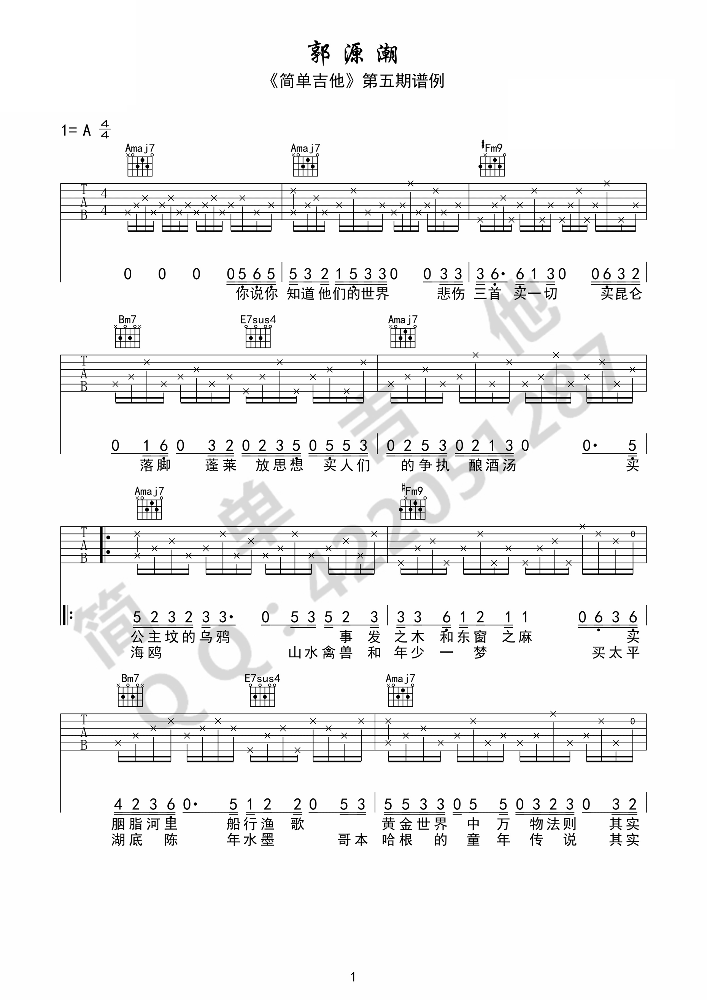
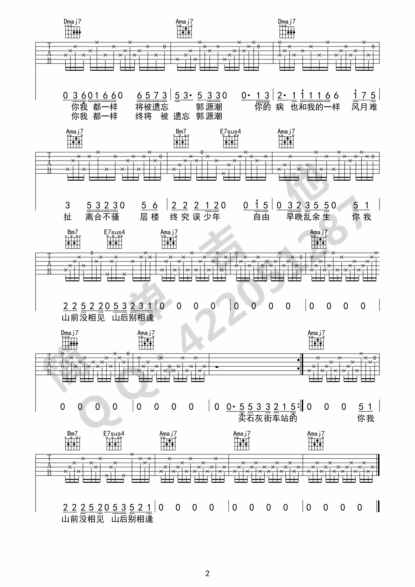

# 郭源潮

> [www.17jita.com](https://www.17jita.com/tab/whole_6894.html)

“其实这个歌就是一个老头儿和一个小孩儿的撕逼，谁也没赢谁也没输，谁都有各自的世界和内心，所以这俩人谁他妈也别互相瞎猜互相逼逼。”

| 歌词 | 释义 |
| --- | --- |
| 公主坟的乌鸦 | 北京一景，每到黄昏时，北京公主坟一带会聚集很多乌鸦，群起群落，场面壮观，一部分人会把此景很悬乎地和某些政治因素联系起来。 |
| 事发之木和东窗之麻 | 源自我的偶像万晓利《陀螺》曲中歌词“在东窗事发的麻木里转”。 |
| 层楼终究误少年 | 源自辛弃疾《丑奴儿》“少年不识愁滋味，爱上层楼。爱上层楼，为赋新词强说愁”。 |
| 石灰街车站 | 位于英国利物浦的“ Lime Street Station”。 |
| 年少一梦 | 字序反过来是“梦遗少年”。 |
| 太平湖底陈年水墨 | 北平伟大作家老舍先生于太平湖投湖自尽。 |
| 哥本哈根 | “童话之都”、“最适宜居住城市”，有世界上最古老的游乐场 Tivoli、自由城 Christiania。 |

## 勘误

1. 第 1 面第 1 行第 4 小结歌词，“悲伤” 改为 “悲歌”。
2. 第 2 面第 3 行第 3 小结，和弦为 `Dmaj7`。
