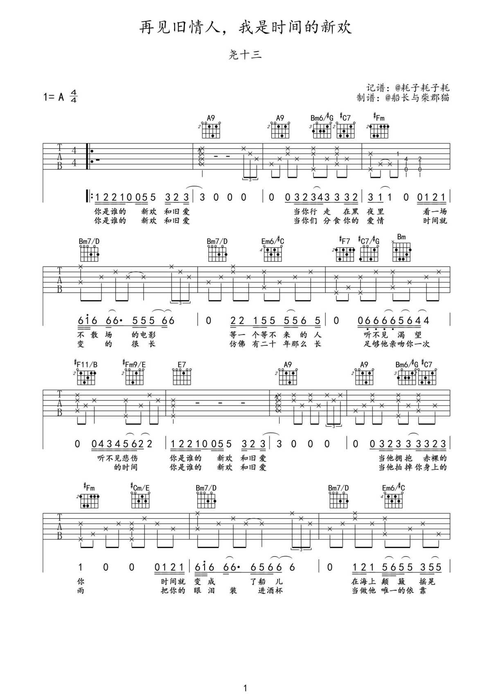
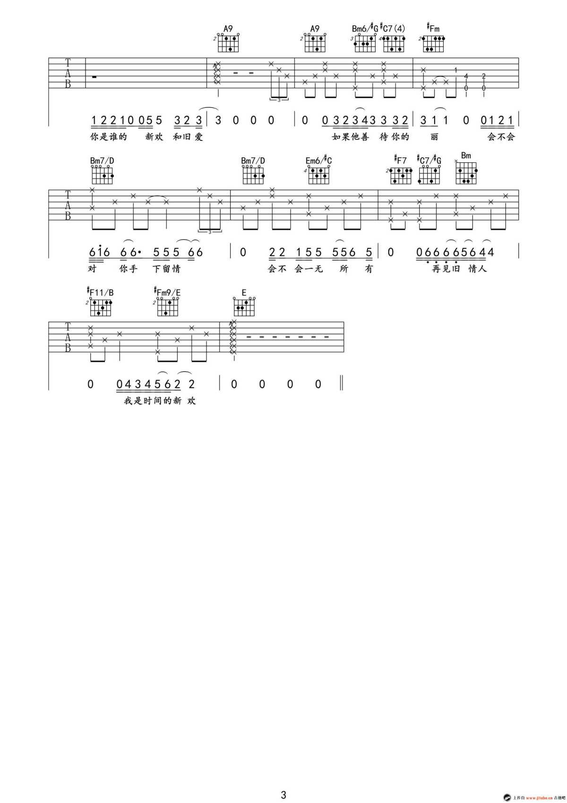

# 旧情人，我是时间的新欢

> “妈妈，那个人疯了，我怕”。  
“不要怕，那人没疯，他只是很伤心”

## 手抄版本

> [www.jitafen.com](http://www.jitafen.com/pu/lxp/124296.html)

## 电子版本

> [www.qinyipu.com](https://www.qinyipu.com/jita/jitapudaquan/13126.html)

