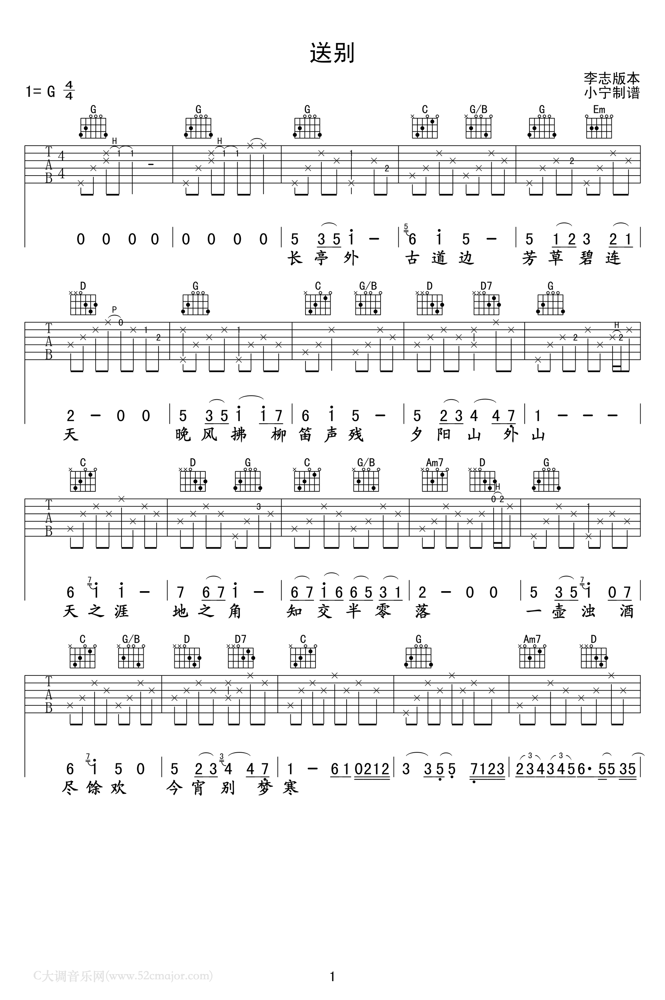
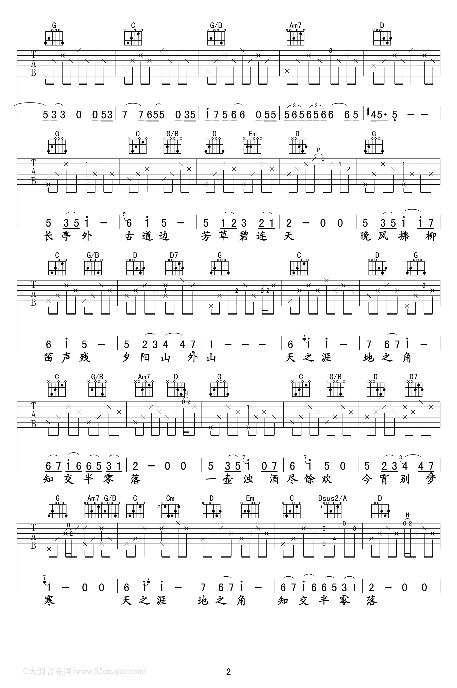
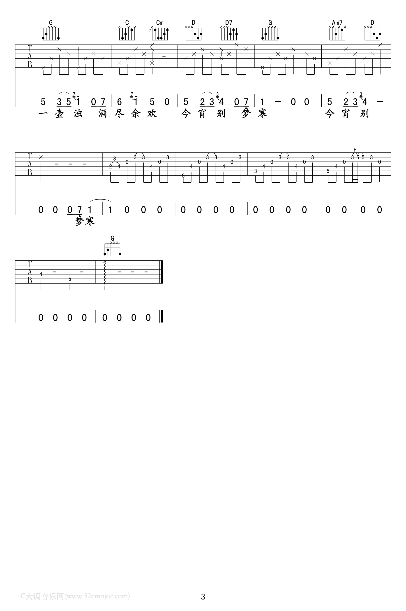

# 送别

> 弘一法师在俗时，有年冬天，大雪纷飞，好友许幻园站在门外喊出李叔同和叶子小姐，说：“叔同兄，我家破产了，咱们后会有期。”说完，挥泪而别。李叔同看着昔日好友远去的背影，在雪里站了很久随后，李叔同返身回到屋内，让叶子小姐弹琴，他便含泪写下：“长亭外，古道边，芳草碧连天...”

> [www.52cmajor.com](https://www.52cmajor.com/tab/72415741596975105)

