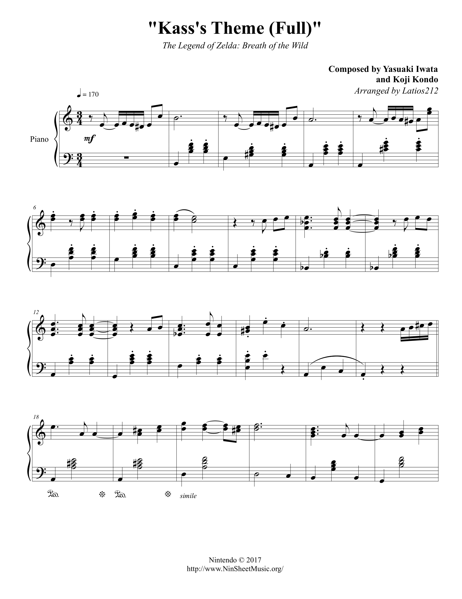
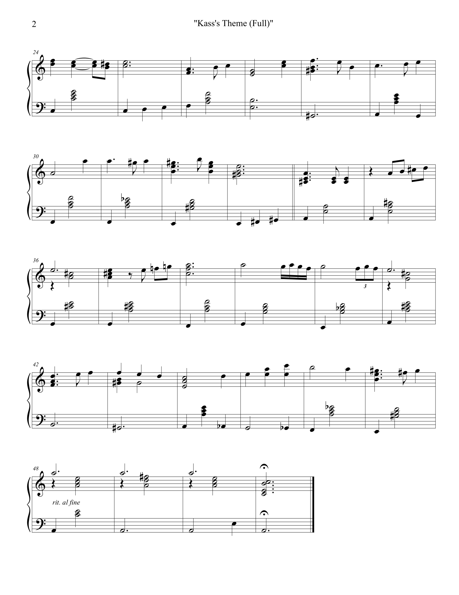
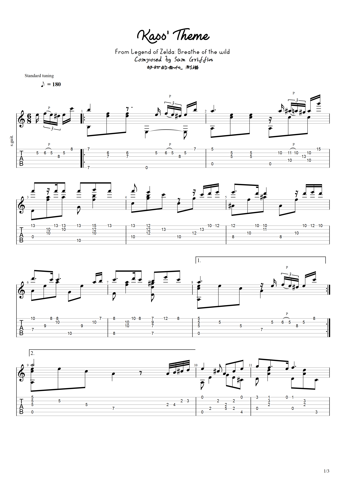
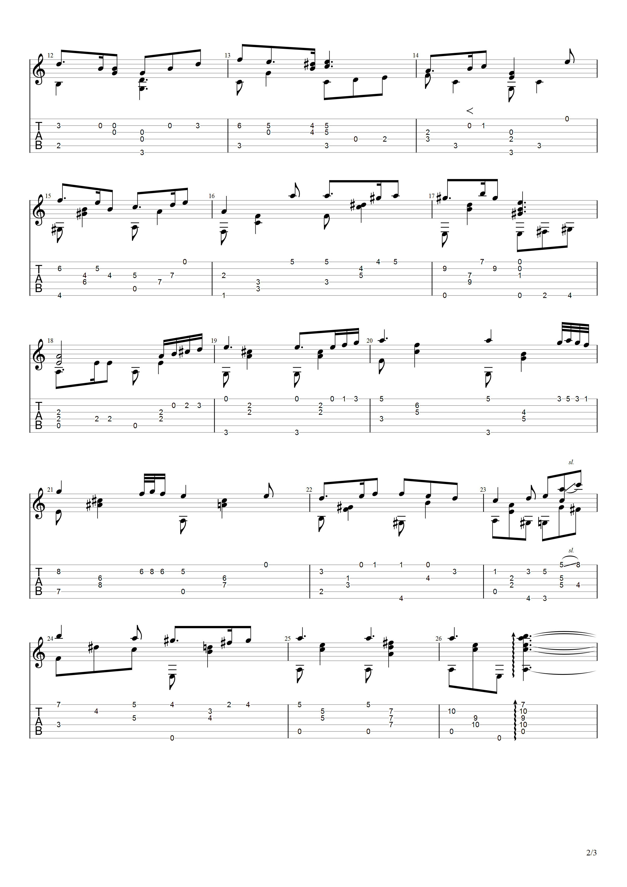

# Kass's Theme

> 我爬上去，和他打招呼。他说他经常会在这里练琴，他喜欢这里的壮丽景色。我和他道别，但没有马上离开，只是站在旁边听着。这时太阳准备下山，夕阳撒在塔顶，照耀着我们，有点刺眼。下面的一大片格鲁多沙漠，和背后的戈壁、悬崖，到处都是橘色。Kass并不太在意我的存在，只是拉着他的琴，一直拉琴。

## 钢琴

> [www.ninsheetmusic.org](https://www.ninsheetmusic.org/download/pdf/3567)

## 吉他

> [www.bilibili.com](https://www.bilibili.com/video/BV1za41177oZ)

关注视频里的 UP 之后私信即可获得琴谱，在这里我为了给自己看所以就直接挂在这里了。如果小伙伴们觉得琴谱不错，还请给琴谱的作者一个免费的关注。

