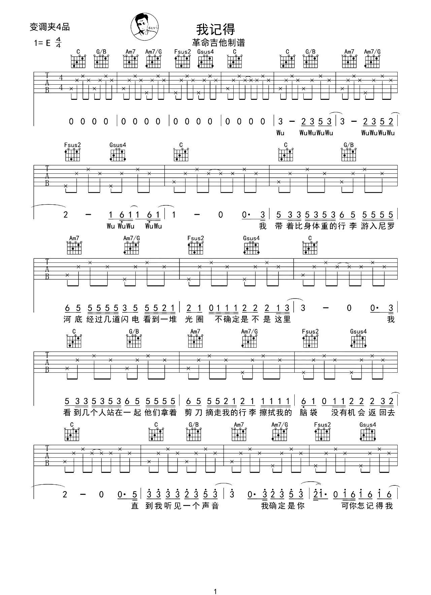
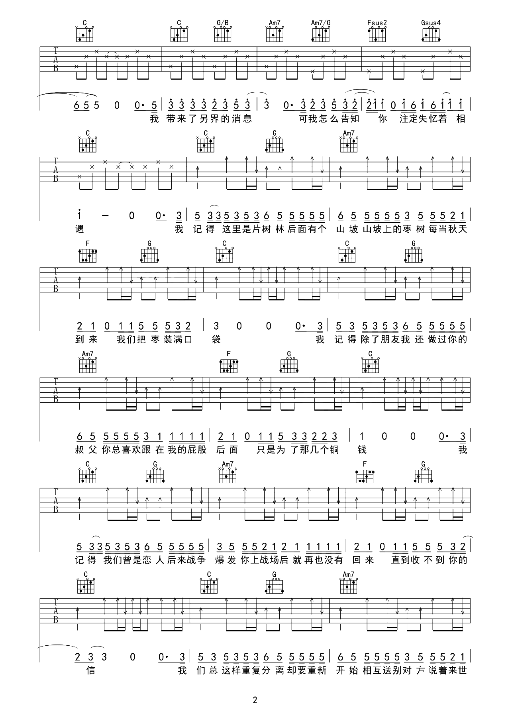
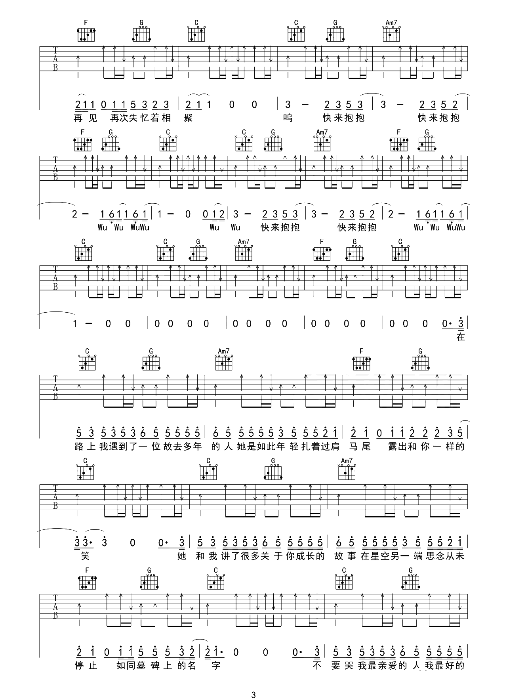
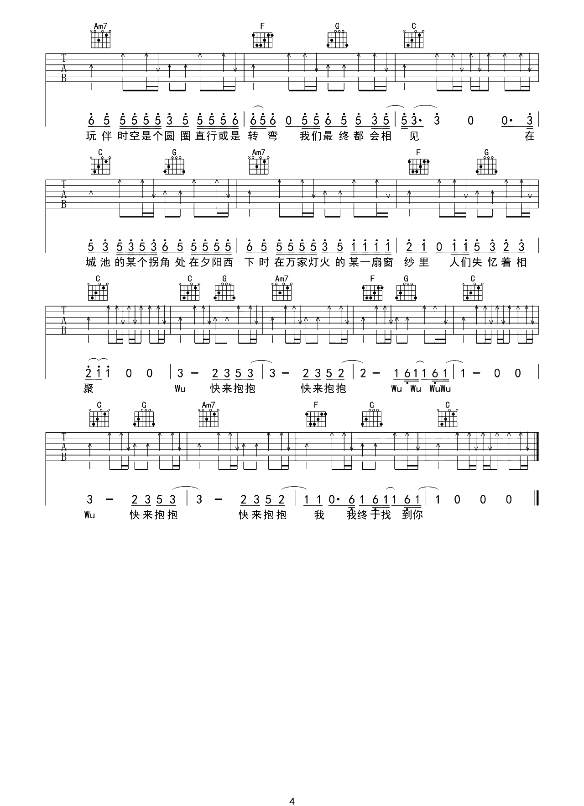

# 我记得

> 你的妈妈也许温柔，也许软弱，也许不讲理，但不论她认识你多久，她不懂你都是正常的。因为她一辈子都生活在她的圈子和阶层里，她没有机会去见你见过的世界，没机会去体验你有幸体验过的人生，所以你应该努力变优秀，并且对她有耐心，然后带她去见识更大的世界，而不是站在她有限的认知外，指责她的无知与狭隘。

> [www.jitakong.com](https://www.jitakong.com/jiaoxue/10158.html)

